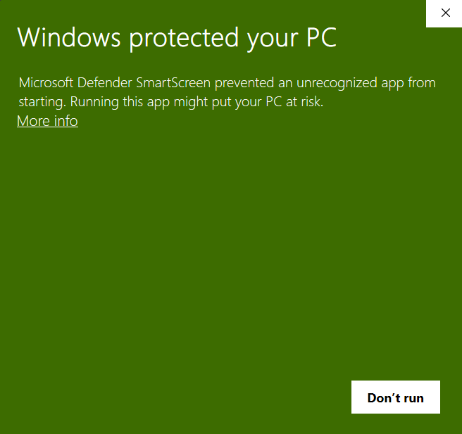
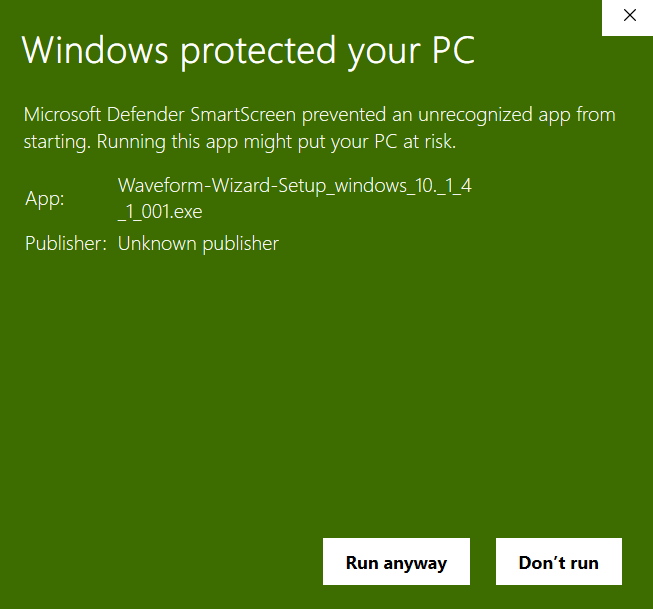
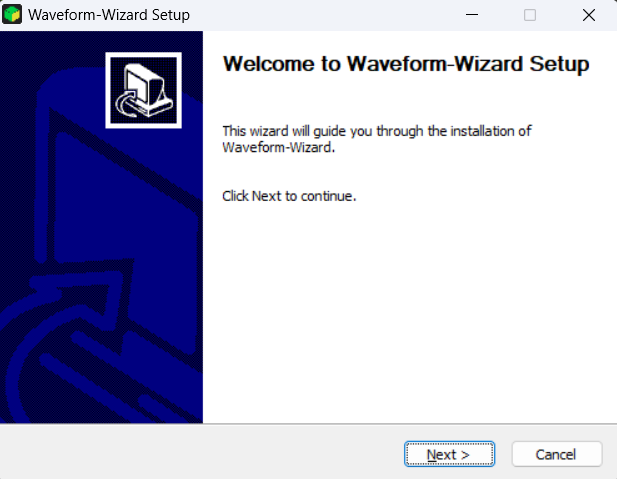
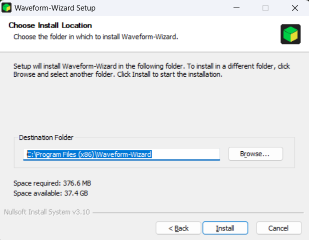
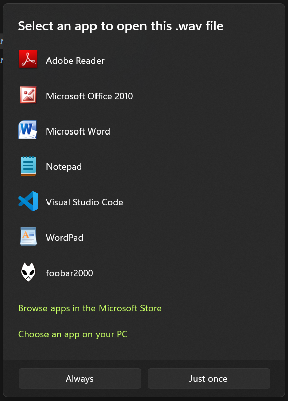
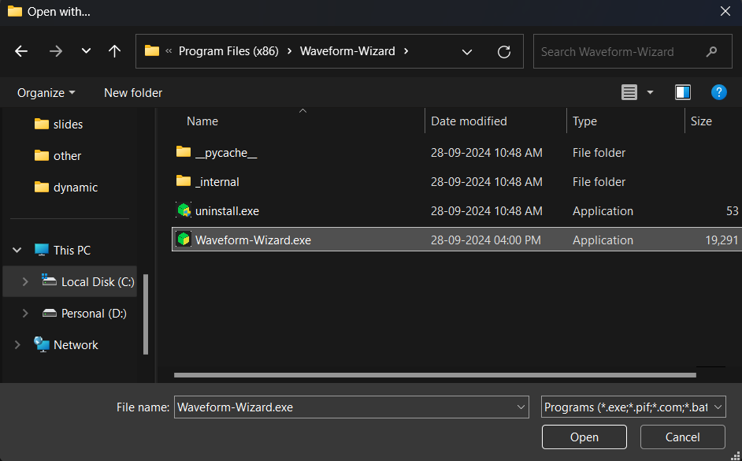
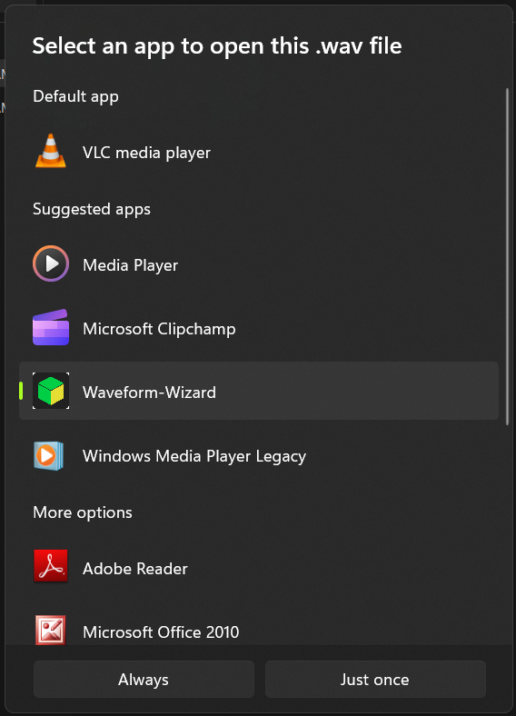
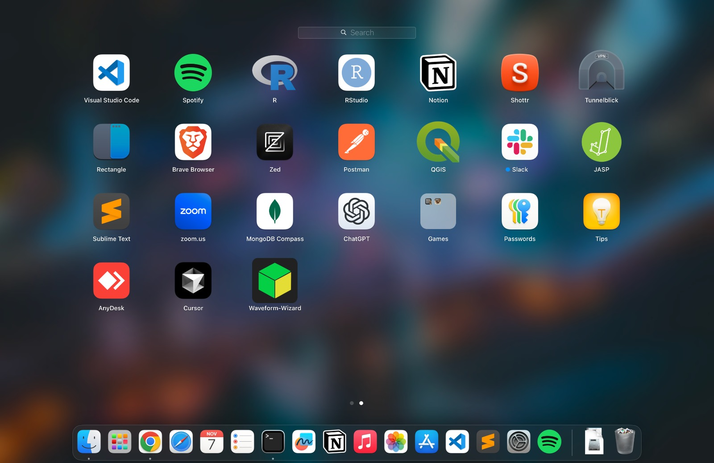

# [Website](https://spl-btp-2k24.github.io/Waveform-Wizard/)

# Waveform-Wizard

Waveform-Wizard is a simple, fast and easy to use application to analyse sound signals

# Installation

## Ubuntu

Download the latest installation files from [Releases](https://github.com/SPL-BTP-2k24/Waveform-Wizard/releases) Page.

* For ubuntu 20.04 -> Waveform-Wizard_ubuntu-20_04.deb
* For ubuntu 22.04 -> Waveform-Wizard_ubuntu-22_04.deb

Open the `.deb` with ubuntu's software installer.

(or)

In terminal, go to the directory containing the downloaded file and run:

```sh
$ sudo apt install ./Waveform-Wizard_ubuntu-<version>.deb
```

## Windows

1. Download the latest installation file from [Releases](https://github.com/SPL-BTP-2k24/Waveform-Wizard/releases) Page.

   * For windows 10, 11 -> Waveform-Wizard-Setup_windows_10.exe
2. Run the `.exe` file.
3. Since we are not licensed developer with Microsoft, Windows doesn't detect the application as safe as shown below:

   

4. Click on `More info`:

   

5. Click on `Run anyway`
6. It will ask for permission to make changes to computer, Click on `yes`.
7. An installer will open, click next:

   

8. It will prompt for an `Installation location`. Change the location by clicking on `Browse..` and choose the desired location. It defaults to `C:\Program Files (x86)\Waveform-Wizard` as shown. Then click `install`:

   

9.  Wait for the installation to complete and click `next`.
10. click `Finish`

### (optional) (windows) File browser setup:

1. Right-click on any `.wav` file, then click on `Open With` > `Choose another App`. A prompt appears as follows:

   

2. Scroll down and click on `Choose an app on your PC`
3. A file browser appears; now select `<installation path>/Waveform-Wizard.exe` and click `Open`.

   > The default installation path is `C:\Program Files (x86)\Waveform-Wizard`, so the path to choose becomes `C:\Program Files (x86)\Waveform-Wizard\Waveform-Wizard.exe`.

   

4. Now you will be back to the application choosing screen. You can now see `Waveform-Wizard` in the list of applications; select it, and click on `Just Once` (or choose `Always` if you want to open all `.wav` files using this application).

   

## Mac-OS

1. Download the latest installation file from [Releases](https://github.com/SPL-BTP-2k24/Waveform-Wizard/releases) Page. Available for:

   * For macos 14 -> Waveform-Wizard_macos-14.dmg
   * For macos 15 -> Waveform-Wizard_macos-15.dmg

2. Open the downloaded `.dmg` file. A window will open like this:

   

3. Drag the `Waveform-Wizard` icon into applications folder to install the app.
4. Since we are not licensed developer with Apple, mac shows the application as 'Damaged'. To solve this, remove the attribute from the app as follows: Open a terminal, run the following command:

   ```sh
   xattr -cr /Applications/Waveform-Wizard.app
   ```

   > Note that it is absolutely safe to run this command.

   

5. You can safely remove the downloaded `.dmg` file from the system.
6. Now, you should be able to see `Waveform-Wizard` in the application tray:

   

# Usage

## Windows

### Normal mode:

1. After completing installation steps, you can open the application by simply searching `Waveform Wizard` in windows search.

### From native file browser:

1. To use it this way, you need to do this one time setup: [instruction](#optional-windows-file-browser-setup)
2. after the one time setup, from the subsequent times open any `.wav` file directly by Right clicking, then `Open With` > `Waveform-Wizard`.

## Ubuntu
1. You can find the application in app tray in ubuntu

## Mac OS
1. You can find the application in app tray in Macos

# Help/Docs:

Visit [Report](https://github.com/SPL-BTP-2k24/Waveform-Wizard/blob/master/Report.pdf) for step by step help in using the application.

# Supported Formats

Visit [here](https://github.com/SPL-BTP-2k24/Samples) to find the supported formats.

# Contributors

- [Abhinav Reddy Boddu](https://github.com/Abhinavreddy-B)
- [Sai Kiran Survi](https://github.com/saisurvi123)
- [Sasidhar Chavali](https://github.com/Sasidhar3159)
- [Losetti Mourya](https://github.com/losettimourya)
